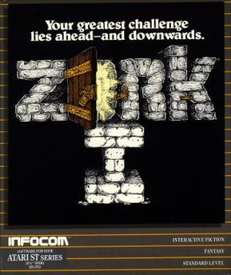

# bx-zork


<br>*Zork I box art © Infocom, used here for reference under fair use; via [Wikipedia](https://en.wikipedia.org/wiki/Zork).*

A from-scratch text-adventure parser engine in [BoxLang](https://boxlang.io), loaded with
the world of **Zork I** ported verbatim from the original 1983 Infocom ZIL
source (MIT-licensed, via [historicalsource/zork1](https://github.com/historicalsource/zork1)).

There are two files:

| File | What it is |
|---|---|
| [`zorkParser.bxs`](zorkParser.bxs) | The engine — tokenizer, grammar matcher, scope resolver, verb dispatcher, combat system, and the REPL/demo runner. No Zork-specific content. |
| [`zorkData.bxs`](zorkData.bxs) | The content — every room and object in Zork I, as data. No engine logic. |

`zorkParser.bxs` `include`s `zorkData.bxs`, so the engine and the world are
cleanly separated: you could drop in a different `zorkData.bxs` (a different
game) and the parser wouldn't need to change.

## Running it

```sh
# Play interactively (reads commands from stdin until "quit"/"exit")
boxlang zorkParser.bxs

# Run a scripted walkthrough instead of waiting for input
boxlang zorkParser.bxs demo
```

If a `zork.save` file exists in the working directory, the game resumes
from it automatically. Use `save` during play to write one.

## Commands

Directions: `north`/`n`, `south`/`s`, `east`/`e`, `west`/`w`, `ne`, `nw`, `se`, `sw`,
`up`/`u`, `down`/`d`, `in`/`enter`, `out`/`exit` — used bare or after `go`.

| Arity | Verbs |
|---|---|
| No object | `look` (`l`), `inventory` (`i`/`inv`), `score`, `pray`, `diagnose`, `listen`, `launch`, `odysseus`/`ulysses`, `save` |
| One object | `examine`/`x`/`inspect`, `take`/`get`/`grab`, `drop`, `open`, `close`/`shut`, `read`, `eat`, `drink`/`sip`, `climb`/`scale`, `wave`/`shake`, `ring`, `wind`, `push`/`move`/`shove`, `board`, `search`, `light`, `extinguish`/`douse`, `turn on`, `turn off`, `raise`/`lift`, `lower`, `rub`, `kick`/`taunt`, `cut`/`slice`/`pierce`, `look under`, `follow`/`pursue`/`chase`, `wake`/`wake up`, `answer`/`reply`, `smell`/`sniff` (also works with no object) |
| Two objects (`verb X <prep> Y`) | `give X to Y`, `put X in/into/on/onto Y`, `tie X to Y`, `unlock X with Y`, `lock X with Y`, `pour X on/onto/in/into Y`, `fill X with Y`, `inflate X with Y`, `burn X with Y`, `dig X with Y`, `turn X with Y`, `attack X with Y` |

Also: `land` (come ashore while boating the river), `throw X` / `throw X at Y`
(drops the object, or has the target duck — smashes the brass lantern if thrown,
breaks the egg if thrown at anything). `quit`/`exit` ends an interactive session.

Parser shortcuts: pronouns (`it`/`him`/`her`/`them` refer to the last named object),
`again`/`g` repeats the last command, `oops <word>` corrects the last unknown word,
`all` and `all but <noun>` work with `take`/`drop`. Multiple commands can be chained
with `.` or `then` (`take lamp. turn it on`).

## How a command becomes a result

Each line of input goes through one pipeline, implemented in
`processCommand()` → `dispatchCommand()`:

```
"attack troll with sword"
        │
        ▼
 tokenize()          split into words, strip noise words (a/an/the)
        │
        ▼
 extractVerb()        match the first word (or two — "turn on" is a
        │             two-word verb) against the verb table
        │
        ▼
 grammar dispatch     zero-object / one-object / two-object, based on
        │             which table the verb is registered in
        │
        ▼
 resolveObject()      find the noun phrase among objects currently in
        │             scope (synonyms + adjectives disambiguate)
        │
        ▼
 handle*() function    the actual game logic for that verb
```

### Tokenizing and the verb table

`tokenize()` just lowercases and regex-splits into words. `extractVerb()`
tries a two-word phrase first (`"turn on"`, `"turn off"`) so those don't get
misread as the single-word verb `turn` (rotate). Every verb is registered in
one of three tables depending on its arity:

- `ZERO_OBJECT_VERBS` — `look`, `inventory`, `score`, `pray`, `odysseus`, ...
- `ONE_OBJECT_VERBS` — `take`, `open`, `read`, `climb`, `attack`, ...
- `TWO_OBJECT_VERBS` — `put X in Y`, `give X to Y`, `unlock X with Y`, ... each
  with its own allowed preposition(s) for splitting the sentence into a
  direct and indirect object

A bare direction (`"north"`, `"in"`) or `go <direction>` is handled before
verb lookup.

### Scope and object resolution

`getVisibleObjectIds()` computes what the player can currently reference:
anything in the current room, anything carried, the contents of any open or
transparent container (recursively), and any "global" scenery objects that
list the current room in their `globalIn` (e.g. the kitchen window is
visible from both *Behind House* and the *Kitchen*). In darkness, this
collapses to carried items only — room contents are invisible and unreachable.

`resolveObject()` matches a noun phrase against that scope by synonym, using
any leading adjectives to disambiguate when a word matches more than one
object (e.g. distinguishing "knife" from "rusty knife" if both were
reachable). Objects outside the current scope but known by vocabulary
produce "You don't see that here." rather than "I don't know that word" —
the same distinction the original game makes.

## The data model (`zorkData.bxs`)

### Objects

Every object is built by `makeObject(id, name, synonyms, desc, takeable, options)`,
which returns a plain struct with ~30 fields covering the ZIL `FLAGS` you'd
expect — `container`/`open`/`openable`, `door`, `light`/`on`, `weapon`,
`readable`/`text`, `value`/`treasureValue` (scoring), `locked`/`unlocksWith`,
and so on. There's no class hierarchy; a struct's fields just happen to be
zero/false for the flags that don't apply to it.

The one field that matters most is **`location`** — every object's
authoritative position, which is just a room id, another object's id
(nested inside a container), or `"player"`. Rooms don't keep their own list
of contents; `describeRoom()` and the scope resolver always filter the full
`objects` struct by `location` live. That means dropping something
somewhere it didn't start, or a villain dragging loot into the Treasure
Room, just works — there's nothing to keep in sync.

A `hidden` flag separately tracks ZIL's `INVISIBLE` — a real, correctly
located object that isn't in scope yet because its reveal trigger (a puzzle)
either isn't implemented or hasn't fired. The trap door, the grating, and
the thief all start `hidden: true` for this reason.

### Rooms

Each room has an `id`, `name`, a `description` (or a `dynamicDescription`
closure for rooms whose text depends on game state — the kitchen window's
open/closed state, the reservoir's water level, etc.), and an `exits` map.

An exit value is one of:

- a plain string — the destination room id, always available
- `{ "blocked": "message" }` — never passable, just flavor text
- `{ "to": id, "requiresOpen"/"requiresFlag"/"requiresNotCarrying"/"requiresEmptyHanded": ... }` —
  conditionally passable
- `{ "per": "name" }` — routed through `PER_EXITS`, for exits with custom
  logic that doesn't fit a simple condition (the one-way maze "diodes", the
  grating, the narrow chimney climb)

Rooms can also have an `onEnter` hook (e.g. the Grating Room reveals the
grate the first time you walk in), mirroring ZIL's `M-ENTER`.

### Game state

`gameState` (in `zorkParser.bxs`) holds everything that isn't a fixed
property of a room or object: the current room, a turn counter, the
player's wound/strength adjustment, and a `flags` struct mirroring ZIL's
boolean globals (`trollFlag`, `lowTide`, `magicFlag`, `domeFlag`, ...) that
puzzles set and exits/descriptions read.

## What's implemented

- **The full map**: all 110 rooms and 122 objects from `1dungeon.zil`,
  descriptions and synonyms taken verbatim.
- **~40 verbs**, including two-object grammar (`put`/`give`/`tie`/`unlock`/...) and `throw`/`hurl`/`chuck`/`toss` (drops the object; `throw X at villain` has them duck; object-specific overrides smash the brass lantern and break the egg).
- **Real combat**, ported from `VILLAIN-BLOW`/`HERO-BLOW`'s actual strength
  tables and message tables — not a stub. The troll, thief, and cyclops are
  all fightable, with the cyclops's `STRENGTH 10000` making direct combat
  with him exactly as suicidal as it is in the original (use `odysseus`/`ulysses`
  or give him water instead).
- **Scoring and the endgame**: taking a treasure banks its points once,
  depositing it in the trophy case banks the rest — same split as ZIL's
  `VALUE`/`TVALUE`. `score` reports a rank from a verbatim port of
  `V-SCORE`'s table. Collecting and depositing everything currently
  reachable sets `wonFlag`, unlocking the path from West of House to the
  Stone Barrow; walking in triggers the real ending text and ends the game.
- **Nearly every named puzzle**, ported verbatim from `1actions.zil` where
  a real mechanic exists to port: the trap door (push the rug), the Torch
  Room descent (tie the rope to the railing), the grate (spot it from the
  maze, unlock with the skeleton key), the dam/reservoir (turn the bolt
  with the wrench, then the drained reservoir reveals the trunk), the
  Hades exorcism (ring the bell, light the candles, read the book), the
  coffin curse (pray at the altar), the rainbow (wave the sceptre, revealing
  the pot of gold), the coal mine (dig for the scarab, run the coal
  machine, the bat, the dumbwaiter basket), egg/canary fragility (breaking,
  winding, the bauble payoff), the mirror rooms (rub to teleport), boating
  the river (board/launch/land, drifting, puncturing), and light source
  fuel timers (the lamp dims and burns out, candles burn down, matches
  burn for two turns each).
- **Darkness and the grue**: rooms without a natural light source (underground
  caves, the maze, etc.) are pitch black unless you're carrying a lit lamp,
  candle, torch, or match. In the dark, room objects are invisible and
  untouchable; after two turns without light the grue starts hunting you —
  each turn a probabilistic roll can print a warning, a grue description, or
  kill you outright, matching ZIL's `GRUE-FCN` probabilities.
- **Save/load**: `save` writes `zork.save` to the working directory (JSON).
  The game auto-loads it on the next interactive start.

## What's not (yet)

What's left is small and tracked in detail in [NOTES.md](NOTES.md):
- A few ZIL-internal simplifications, called out in NOTES.md per puzzle —
  `MIRROR-MUNG` (breaking a mirror) and repairing a punctured boat with putty.

If you're picking this up: search for `TODO` and `note` in `zorkData.bxs` —
every known gap is annotated in place rather than silently faked.
